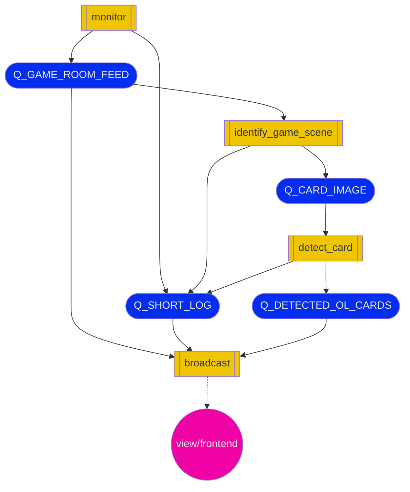

# descentinel
Support app for the board game Descent v1 that keeps watch over a physical game in progress.

1. The app consists of various backend services:
    - [monitor](#monitor-stream-the-game-pieces-as-images): always watching...
    - [identify_game_scene]()
    - [detect_card](#detect_card-recognize-various-cards): which card am I holding in the camera?
    - [broadcast](#broadcast-provide-get-for-frontends): a web server for backend-frontend communication
    - [view](#view-frontend-for-the-browser): a web frontend
1. All backend services are connected to rabbitmq pub/sub channels
1. The entire app runs on a small device (Raspberry Pi)

## Interplay of backend services

Here is a visual display of the queues going out an into various services.

## monitor: stream the game pieces as images

What?
- A continuous video feed from a small camera is chunked into still images for downstream services to digest.

Why?
- This is the eye of the app. It's the one source of information for any component of descentinel.

How?
- Capture video signal and chop it into still images in pre-defined time intervals using rust.

## identify_game_scene: higher-level discrimination of game scene

What?
- The image depicting the game situation is analyzed and the scene identified as e.g. "card", "board", etc.

Why?
- The purpose of this service is to route the game room image to more specific queues downstream.

How?
- rust
- opencv scene recognition

## detect_card: recognize various cards

What? 
- An image of a card is given to this service. Based on character recognition, the contents of this card are matched against a database of cards and the correct card type and card are identified.

Why?
- Other services may use the context information to display more infos about the card. Examples may be translations from other languages or information from http://www.descentinthedark.com.
- Ultimately we have a (ro)bot playing with us and using and referencing the physical components.

How?
- rust
- tesseract for character recognition

## broadcast: provide GET for frontends

What?
- Any content produced by a backend service and pushed to some rabbitmq queue is published over a GET.

Why?
- Frontend technology should be decoupled from messaging in the backend, hence a dedicated web server.

How?
- rust
- warp

## view: frontend for the browser

What?
- Anything available via broadcasted GET is displayed in a web page.

Why?
- Game information should be viewable on any device.

How?
- solidjs

---
Descent: Journeys in the Dark is Copyright © Fantasy Flight Games. All rights reserved.
